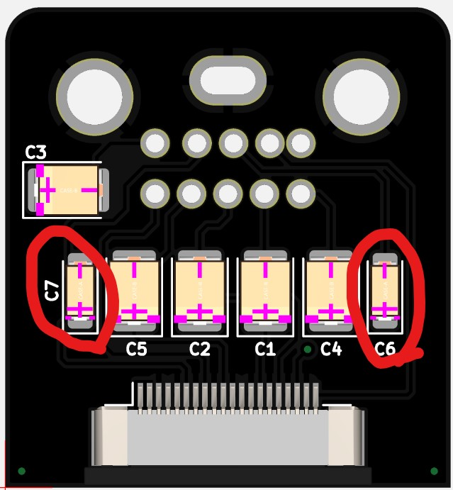

# Turbonanza - Duo Installation Instructions

This document covers the installation process for a PC Engine/Turbo Duo (original model). Thanks to [PowrUpGaming](https://twitter.com/PowrUpGaming) for the install photos.

The same general idea can be applied to the Duo R/RX installation, with the difference being that the HuC6260 is on the top side instead of bottom.

## Step 1 - Determine Mounting Location
Find a mounting location for the turbonanza board and secure with double-sided tape or simply with kapton tape. If using double-sided tape, wait until all of the wires are soldered before taping down.

## Step 2 - Solder RGB/CSYNC
Solder wires for RGB and SYNC to the HuC6260 pins as shown. The pinout is as follows:

Pin 49 - Red
Pin 47 - Green
Pin 51 - Blue
Pin 44 - Sync

## Step 3 - Remove resistors for S-Video

Remove resistors R919-R922 and solder the 4 wires for Luma (Y), B-Y, R-Y and Burst to the pads indicated.

## Step 4 - Solder wires for 5V and GND

Locate connections for 5V and GND, preferrably across a capacitor. The following is an example - there are multiple points for 5V/GND available.

## Step 5 - Solder all wires to to the Turbonanza

All connections are labeled on the bottom of the board, but this image may also be used as reference.

At this time, the following connections should be made to the turbonanza:
5V, GND, R, G, B, Sync, Y, R-Y, B-Y, Burst

## Step 6 - Remove original 5 Pin DIN, install 10 Pin DIN

See CoreGrafx for DIN and mounting board installation.

## Step 7 - Audio

Tap the Duo's audio output circuit - the signals can be directly obtained from the original DIN pins as shown below. 

For original revision Turbonanza's, remove C19 and C20. Right audio connects to C20-negative and Left audio connects to C19-negative.

For newer Turbonanza's, remove C6 and C7 from the DIN-FFC board, and connect Right audio to C6-Negative and Left audio to C7-Negative.

