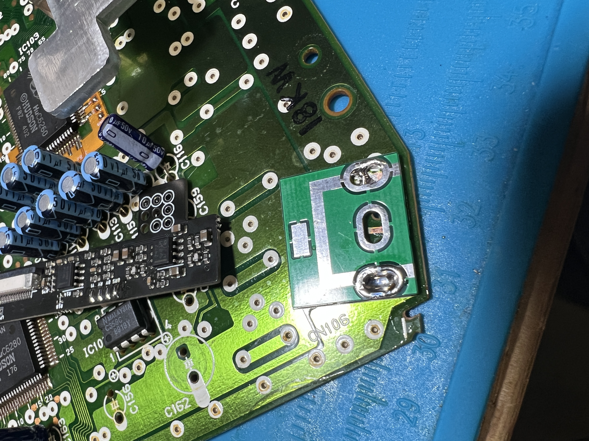

# Shuttle Installation

NOTICE - this will require some interior trimming of the case. Nothing major, but be forewarned.

## Step 1 - Optional HuFlex Install

Tin both sides of the HuFlex pads that will solder to the HuC6260. Also flux/reflow the solder around the HuC6260 to facilitate installation. Finally, carefully install the flex as shown.

## Step 2 - Remove Audio/Video Capacitors

Remove the capacitors in the red boxes.

## Step 3 - Remove Original DIN, install mounting board

Remove the stock 5-pin DIN and install the mounting board (see CoreGrafx for more detail). 

## Step 4 - Trim interior ribbing

Cut the 4 small tabs off of the top shell flush with the rest of the surrounding features.

## Step 5 - Solder DIN

Solder the 10 Pin DIN to the DIN Mount board.

## Step 6 - Solder Video Connections

Solder the video connections from the HuFlex to the Turbonanza board. Refer to the pinout below. Y / B-Y / R-Y / Burst are marked on the Turbonanza itself.

If not using the HuFlex, the HuC6260 pins are as follows:

Red - P49
Blue - P51
Green - P47
Sync - P44

5V/GND - Most convenient wiring location

Y - P40
R-Y - P33
B-Y - P26
Burst - P20

## Step 7 - Solder HuD / CD Audio Left connection

Solder a wire to Pin 1 of the cartridge slot, then connect to the HuD/CDR pin on the Turbonanza.

## Step 8 - Solder Remaining Audio Connections

Solder the Audio Left/Right, CD Left and 5VA connections. See the following image for signal locations.
*NOTE* Pin 2 on the HuCard slot can also be used for "CD Left"

## Step 9 - Install FFC cable and DIN FFC board

Install the FFC cable to the Turbonanza, Solder the DIN FFC board in place, and connect the FFC to finish the installation.

